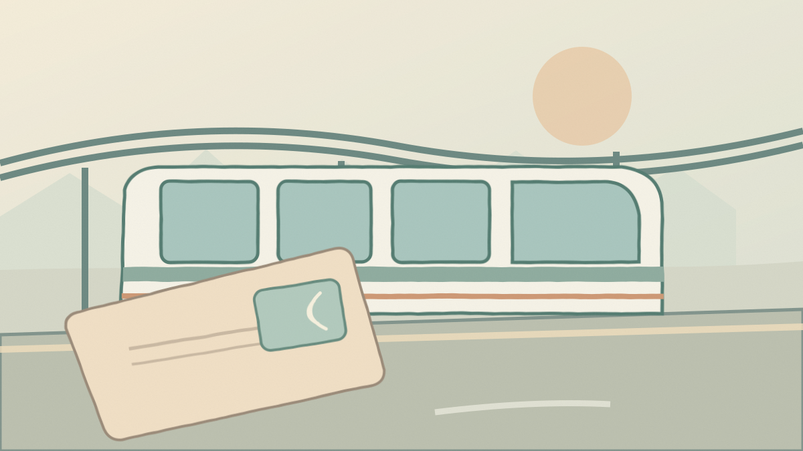

# TripCaution — First Three Field Notes

**Full article previews for editorial review.** These are source-grounded drafts, **not yet published on the live site**. Review time-sensitive claims and source pages before approval; the canonical import data is [starter-guides.json](starter-guides.json).

---

# 1. Your First Taxi Ride in Vietnam: Seven Checks Before You Get In

**Destination:** Vietnam  
**Category:** transport  
**Editorial status:** Pending human review  
**Research snapshot:** 28 September 2026  
**Summary:** From choosing a pickup point to checking the vehicle details, this simple routine helps first-time visitors navigate taxis and app-booked rides in Vietnam.

Arriving somewhere new is often easiest until the moment you step outside the terminal. You have an address on your phone, luggage in your hand and several ways to get there. In Vietnam, a little preparation can make that first ride considerably simpler.

Vietnam's official tourism website describes taxis, buses and ride-hailing services as everyday ways to travel in its cities. The UK's travel guidance also offers specific precautions for choosing taxis and checking app-booked vehicles. Neither source suggests avoiding city transport altogether. The more useful lesson is to make a few decisions **before** someone asks where you're going.

## 1. Choose your ride before you reach the pickup area

Decide whether you want a metered taxi, an app-booked car, or a prearranged hotel pickup while you still have airport Wi-Fi. Compare the available options and look up where each one actually collects passengers. A legitimate pickup area and the nearest exit are not necessarily the same thing.

Vietnam Tourism describes taxis and ride-hailing as options in major cities. The [UK's Vietnam travel advice](https://www.gov.uk/foreign-travel-advice/vietnam/safety-and-security) recommends reputable taxis and, where practical, arranging one through a hotel or restaurant. That is a useful approach if you would rather not work out the pickup system on arrival.

## 2. Confirm the address in a form the driver can use

Save your accommodation's complete address and, ideally, a map pin. Large Vietnamese cities have streets with similar names, several hotel branches and entrances that are easy to miss. A screenshot can still be useful when your mobile data connection is unreliable.

Rather than relying on an approximate neighborhood, check the exact street address against your reservation. If you use an app, check the destination pin before confirming the booking. This is a general navigation precaution, not a claim that any particular district or service is problematic.

## 3. For app bookings, match the car—not just the story

If you've ordered a ride in an app, compare the arriving vehicle and driver with the information shown in your booking. The [UK travel advisory](https://www.gov.uk/foreign-travel-advice/vietnam/safety-and-security) specifically recommends matching the vehicle and driver details when using an app-booked taxi.

Do this before loading your bags. If something doesn't match, check your booking rather than getting into a car simply because its driver knows your destination. The same habit is worthwhile in almost any unfamiliar city.

## 4. Know how an ordinary taxi fare is supposed to work

For a conventional taxi, confirm that the meter will be used before the journey begins. Vietnam's [official tourism guidance](https://vietnam.travel/node/26) recommends asking for the meter and explains that ride-sharing apps are another option in major cities.

Avoid treating a fare you saw in an old blog post as today's guaranteed price. The route, time, traffic, pickup rules and fare schedule may have changed. When comparing options, use information available at the time of the trip.

## 5. Keep the essentials with you

Put your passport, phone, wallet and other important items in a bag you can keep beside you rather than somewhere difficult to reach. Save the vehicle details and booking confirmation if your app provides them.

A second small preparation: download an offline map or save a route screenshot. Mobile service can fail even when you have purchased a travel SIM or eSIM. The aim isn't to track every turn; it's to have enough context to recognize when you have arrived and communicate the right destination.

## 6. Don't turn a short city ride into an unplanned motorbike rental

A car ride and riding a rented motorbike are entirely different decisions. If you're considering driving yourself, check which licence or driving permit applies to **your** nationality, whether you have the right insurance, and whether you have appropriate experience. Rules and insurance eligibility differ by traveler.

The [UK advice for Vietnam](https://www.gov.uk/foreign-travel-advice/vietnam/safety-and-security) warns about motorbike injuries, recommends adequate protective equipment and cautions British travelers against renting when inexperienced. It also advises against leaving a passport as a vehicle-rental deposit. Travelers from other countries should consult their own government's guidance rather than assume British licensing requirements apply to them.

## 7. Have a simple backup plan

Before leaving the airport or your hotel, save one alternative way to reach your destination. It might be a second booking option, the accommodation's contact details or a public-transport route. This gives you a straightforward next step if a pickup is cancelled or you cannot find the vehicle.

**A two-minute arrival checklist**

- Save the exact accommodation address and map pin.
- Decide on an app booking, metered taxi or arranged pickup.
- Locate the actual pickup zone.
- Match app-booked vehicle and driver details before boarding.
- Confirm how a conventional taxi fare will be calculated.
- Keep important belongings and a backup route accessible.

Vietnam has many practical ways to get around. The goal isn't to make your arrival feel complicated; it's to prevent a few avoidable uncertainties from piling up at the same moment.

*Research checked: 28 September 2026. Transport operations, fares and local conditions can change. Confirm time-sensitive details with the operator or your accommodation.*

### Article sources

1. [Safety and security — Vietnam travel advice](https://www.gov.uk/foreign-travel-advice/vietnam/safety-and-security) — UK Foreign, Commonwealth & Development Office
2. [Plan your trip — Vietnam Tourism](https://vietnam.travel/node/26) — Vietnam National Authority of Tourism
3. [Transport within Vietnam](https://vietnam.travel/vi/plan-your-trip/transport-within-vietnam) — Vietnam National Authority of Tourism

### Editor's verification notes

- Current taxi fares and airport pickup arrangements differ by city and operator; no exact price claims are included.
- Driving documentation varies by nationality and vehicle category. UK advice is only identified as UK-specific guidance.

---

# 2. Bangkok in Heavy Rain: A Smarter Airport Transfer Plan

**Destination:** Bangkok, Thailand  
**Category:** transport  
**Editorial status:** Pending human review  
**Research snapshot:** 28 September 2026  
**Summary:** A date-stamped guide to choosing between airport rail and road transport, with a practical backup plan when Bangkok's weather disrupts your journey.

A Bangkok airport transfer can look wonderfully simple on a map. But a scheduled landing time, a hotel address and an optimistic drive-time estimate are not always enough—particularly during periods of heavy rain.

This guide combines Thailand's established airport-rail information with a **26 September 2026** visitor update from the Tourism Authority of Thailand (TAT). The weather notice is a dated snapshot, not a prediction for your travel day. Check fresh conditions before choosing a route.

## First, check which Bangkok airport you're using

Bangkok's two major airports are **Suvarnabhumi (BKK)** and **Don Mueang (DMK)**. They are not interchangeable, and a rail route described for one airport should never be assumed to serve the other. Before you book your transfer, confirm the airport code on the ticket and locate your hotel's nearest useful railway station.

For travelers arriving at BKK, Thailand's official government portal describes the **Airport Rail Link City Line**, with a terminal station at Phaya Thai and an interchange toward Bangkok's urban rail network. This gives some visitors a useful alternative to an entire journey by road. The same source notes that the former Airport Rail Link Express Line is not operating; old travel posts can still describe it, so double-check the train name. See the [official Airport Rail Link explainer](https://thailand.go.th/public/issue-focus-detail/001_01_107-2).

## Why rain changes the calculation

In a [visitor bulletin dated 26 September 2026](https://www.tatnews.org/2026/09/weather-and-travel-conditions-in-bangkok-and-surrounding-areas-visitor-information/), TAT reported rainfall and localised flooding in parts of Bangkok and surrounding areas. It warned of possible road delays, particularly for airport trips and journeys to transport hubs, while advising travelers to check current conditions and allow extra time.

That bulletin also reported that BKK and DMK remained operational **at the time of its update**. It is not evidence that routes or flight operations will have the same status when you read this. Weather-related conditions can change within hours.

The broader lesson is simple: when rain is affecting roads, compare a rail-based route with a direct car journey rather than assuming either is automatically quicker.

## Compare the entire journey, not just the airport leg

An Airport Rail Link journey from BKK may help you avoid some road congestion, but your hotel might still be a substantial walk, another rail journey or a taxi ride away. Check the last portion of the journey before you leave the airport.

Use three questions to make the comparison:

- **How close is the hotel to a useful station?** A rail journey may be convenient when the final walk is short, but less comfortable with large luggage or an inaccessible route.
- **What time will you actually leave the terminal?** Immigration, baggage collection and walking to the station all matter. Confirm the operator's current service hours rather than relying on a timetable copied from an older guide.
- **What happens if one leg is disrupted?** Know which alternative station, taxi pickup point or hotel contact you could use.

Thailand's [government transport guide](https://www.thailand.go.th/issue-focus-detail/002_001) describes several Bangkok rail networks. Use it to understand the different systems, then check live station and service information for the specific route you intend to take.

## If you're taking a car, build in flexibility

A direct taxi or arranged car may still be the right choice, especially if your accommodation is far from the railway or you are traveling with several people. During active rainfall, however, a very precise road-time estimate can give false confidence.

Confirm the pickup location, share the hotel address in writing and leave room for delays before a time-sensitive connection. If you have a flight to catch, check the airport and airline's latest guidance **on the day you travel**. TAT's September bulletin is useful evidence that disruption occurred, not a standing recommendation for an exact number of extra minutes every day.

## Avoid relying on a single weather screenshot

A weather forecast tells you about expected weather; it doesn't necessarily tell you which airport approach road, station entrance or connecting street is passable. Pair weather information with real-time operator notices and local transport updates.

If authorities advise against a route, do not treat a ride-hailing app's estimated arrival time as proof that it is safe or accessible. Conditions around a station can differ from train operating status.

## Your backup plan in five checks

- Recheck your flight's airport code and your hotel's full address.
- Compare the current rail route with a road transfer, including the final leg.
- Read a fresh airport, rail-operator or official visitor update for **your actual travel date**.
- Keep an alternative pickup or station in mind.
- Allow breathing room before flights, tours or nonrefundable appointments.

The purpose of checking isn't to turn a holiday into a logistics project. It's to choose a route with fewer assumptions—and still have a good option when Bangkok's weather has other plans.

*Research checked: 28 September 2026. The referenced weather bulletin was issued on 26 September 2026; its incident-specific conditions must not be treated as continuously current. Recheck official advice before publishing and before traveling.*

### Article sources

1. [Weather and travel conditions in Bangkok and surrounding areas — Visitor information](https://www.tatnews.org/2026/09/weather-and-travel-conditions-in-bangkok-and-surrounding-areas-visitor-information/) — Tourism Authority of Thailand (2026-09-26)
2. [Where can the Airport Rail Link from Suvarnabhumi Airport take me?](https://thailand.go.th/public/issue-focus-detail/001_01_107-2) — Government of Thailand (2023-03-13)
3. [Bangkok public transport guide](https://www.thailand.go.th/issue-focus-detail/002_001) — Government of Thailand

### Editor's verification notes

- TAT's 26 September bulletin is date-specific; roads and airport operations could have changed after the announcement.
- Rail routes, service hours, fares and connection logistics must be rechecked on the actual travel day.
- This transport guide is not a real-time emergency or weather-alert service.

---

# 3. Singapore Transport Payments: What to Know Before Your First MRT Ride

**Destination:** Singapore, Singapore  
**Category:** before-you-go  
**Editorial status:** Pending human review  
**Research snapshot:** 28 September 2026  
**Summary:** You can tap many overseas bank cards on Singapore's trains, but the foreign-card fee, delayed charges and airport interchange are worth knowing about first.

Singapore's MRT is refreshingly straightforward once you understand one small distinction: paying at a train gate isn't quite the same experience as paying at a café. The card you use, the charges you see and even the route you take from the airport can surprise a first-time visitor.

Here is a short, source-checked plan for your first journey—without assuming that you need to buy a special tourist card.

## Yes, many overseas bank cards work

Singapore's [Land Transport Authority](https://www.lta.gov.sg/content/ltagov/en/getting_around/public_transport/plan_your_journey.html) lists contactless bank cards, mobile wallets and stored-value cards among public-transport payment options. The [SimplyGo guidance](https://www.simplygo.com.sg/faqs/cards-and-charms/simplygo/contactless-bank-cards) explains that eligible foreign-issued cards can be tapped directly at fare gates and bus readers.

But **eligible** is the important word. Not every card from every issuing bank will work, even if the card supports contactless shopping. Before the flight, enable overseas use where required by your bank and bring a backup payment method.

You don't need to register a normal eligible contactless bank card with SimplyGo merely to start using it for transit. Registering in the app can be helpful if you want to inspect trips and posted charges later.

## The small daily fee visitors often miss

As checked on 28 September 2026, SimplyGo states that a **SGD 0.60 foreign-bank-card administration fee per day of use** applies when using foreign-issued Mastercard or Visa cards for Singapore public transport. Your own issuing bank may also charge fees, so the final cost depends on the card.

See [SimplyGo's contactless-card FAQ](https://www.simplygo.com.sg/faqs/cards-and-charms/simplygo/contactless-bank-cards) and its [guidance on foreign-card top-ups](https://simplygo.com.sg/faqs/cards-and-charms/top-ups/top-ups-via-foreign-issued-creditdebit-cards/) before choosing a payment method.

This doesn't mean a foreign card is a bad option. If you only take a few rides, convenience may matter more to you than obtaining another card. If you'll ride repeatedly over several days, compare that daily fee with the upfront cost and any top-up fees of a stored-value card or the price and coverage of a tourist pass. Choose based on **your actual itinerary**, not a blanket claim that one product is always cheapest.

## Use exactly the same payment method to tap in and out

Here's a practical habit: take the payment card you intend to use out of your wallet before approaching the gate. Use that **same card or same mobile-device payment credential** when you exit.

SimplyGo advises using the same payment instrument for entry and exit so trips are matched correctly. Switching from your physical card to a mobile-wallet version midway through a journey can result in what the system sees as a different credential. A crowded wallet can also make it harder to tell which card has been read.

If a fare gate says that your card isn't supported, do not keep trying unrelated cards while standing in the lane. Step aside, check the issuer's eligibility and use your backup payment option or ask station staff.

## Why the charge may appear later

Contactless transit payments are not necessarily posted as a separate instant retail charge after each ride. [SimplyGo explains](https://www.simplygo.com.sg/faqs/cards-and-charms/simplygo/contactless-bank-cards) that fares may be accumulated before posting, with timing that depends on the card network and your bank.

This matters when you're checking your statement at night: a delayed or grouped transit charge isn't automatically evidence of an incorrect fare. If you want more detail, you can use the SimplyGo app to review eligible registered card transactions and travel history.

## From Changi Airport: plan the transfer as well as the payment

The [official Changi Airport transport guide](https://www.changiairport.com/en/at-changi/transport-and-directions/leaving-the-airport.html) describes the airport train connection. Travelers heading toward the city can use Changi Airport MRT Station and connect through **Tanah Merah** toward the East West Line; **Expo** is another possible transfer to the Downtown Line depending on your destination.

Check which terminal you arrive at and the station route that best matches your accommodation. The airport's published guidance notes that the MRT station connects directly to Terminals 2 and 3. Visitors arriving elsewhere should allow time to reach the station.

If your flight arrives very late, don't assume trains run all night. Changi's official information notes that most trains and public buses do not operate overnight, while airport taxis and private-hire cars remain available.

## The first-ride checklist

- Check whether your bank card is eligible for Singapore transit and enabled for overseas use.
- Know that foreign-issued Mastercard and Visa transit use may carry the published daily fee.
- Keep a backup payment method.
- Tap with the same card or credential when entering and leaving.
- Allow time for your Changi terminal-to-station connection.
- Confirm train operating hours if your flight lands late.

An hour spent understanding the basics before your flight can save several puzzled minutes at a fare gate. Singapore's system offers multiple ways to pay; the best one is the one you understand and can use reliably.

*Research checked: 28 September 2026. Transit charges, eligible cards, routes and operating hours may change. Always confirm the latest details with the operator and your issuing bank.*

### Article sources

1. [Plan Your Journey: public-transport payments](https://www.lta.gov.sg/content/ltagov/en/getting_around/public_transport/plan_your_journey.html) — Singapore Land Transport Authority
2. [FAQs for contactless bank cards](https://www.simplygo.com.sg/faqs/cards-and-charms/simplygo/contactless-bank-cards) — SimplyGo
3. [Top-ups via foreign-issued credit/debit cards](https://simplygo.com.sg/faqs/cards-and-charms/top-ups/top-ups-via-foreign-issued-creditdebit-cards/) — SimplyGo
4. [Leaving Changi Airport: Transport Options](https://www.changiairport.com/en/at-changi/transport-and-directions/leaving-the-airport.html) — Changi Airport Group
5. [Getting to Changi Airport](https://www.changiairport.com/en/at-changi/transport-and-directions/getting-to-changi-airport.html) — Changi Airport Group

### Editor's verification notes

- SimplyGo's published SGD 0.60 per-day fee and supported cards should be rechecked before publishing or after any operator notice.
- A foreign bank's own foreign-exchange or transaction fee is bank-specific.
- Train hours differ by route and date and should be checked with the operator.
